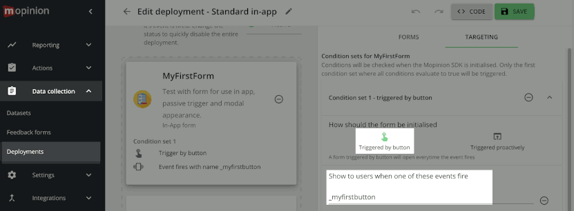

# Mopinion Mobile SDK for android
The Mopinion Mobile SDK can be used to collect feedback from Android apps based on events.
To use Mopinion mobile feedback forms in your app you can include the SDK as a Library in your Android Studio project.

There are also other Mopinion SDK's available:

- [iOS SDK (React Native required)](https://github.com/mopinion/mopinion-sdk-ios)
- [iOS web SDK](https://github.com/mopinion/mopinion-sdk-ios-web)
- [Android SDK (React Native required)](https://github.com/mopinion/mopinion-sdk-android)

### Contents

- Release notes
- [Installation](#install)
- [Implement the SDK](#implement)
- [Submitting extra data](#extra-data)
- [Evaluate if a form will open](#evaluate-conditions)
- [Using callback mode](#callback-mode)
- [Edit triggers](#edit-triggers)

## Release notes for version 0.3.0

### New features in 0.3.0
- 2 new variants of the method `event()` add a asynchronous callback response `onMopinionEvent()`, to let you receive a certain `MopinionEvent` from the SDK about the feedback form.
- Currently supported `MopinionEvents` are when the form is displayed, when the user submitted the form or when the form closed.
- The callback includes an object `MopinionResponse` that can optionally contain data associated with some events. Data can be for example the form key, the form name or miscellanous data as JSONObject.
- The new callback behaviour is optional. You don't need to change your existing code, the SDK by default will behave as before without making callbacks.

## <a name="install">install</a>

Install the Mopinion Mobile SDK Library by adding it to the `build.gradle` file of your project. The minimal required Android API level is 19.

Download our [Mopinion Forms](https://play.google.com/store/apps/details?id=com.mopinion.news) app from the Google Play Store to preview what your mobile forms will look like in your app.

### dependencies

- [Google Volley](https://github.com/google/volley)

### Android Studio

In the main project `build.gradle` file add the following:

```gradle
allprojects {
    repositories {
        google()
        maven { url 'http://jitpack.io' }
    }
}
```

 
In the `build.gradle` file of your main module, add the Mopinion SDK Library:

```gradle
android {
	...
}
...
dependencies {
    ...
	implementation 'com.mopinion:mopinion-sdk-web:0.3.0'
}
```

The SDK needs to connect to the Mopinion servers so the internet permission should be added to your `AndroidManifest.xml`:

```xml
<?xml version="1.0" encoding="utf-8"?>
<manifest xmlns:android="http://schemas.android.com/apk/res/android"
    package="com.example.app">
    
		<uses-permission android:name="android.permission.INTERNET" />
		
		<application
		...
```

### <a name="implement">implement the SDK</a>

In the activity source file, include these lines to import, open and call the MopinionSDK:

```java
import com.mopinion.mopinionsdkweb.*;
...
// idealy only init this once, i.e. in an onCreate()
Mopinion M = new Mopinion(Context context, String key, boolean log);
...
// somewhere else in the same class
M.event(String event);
```

* The `context` is the Activity context from which you would like to activate the feedback form, normally `this`.
* The `key` should be replaced with your specific deployment key. This key can be found in your Mopinion account at the `Feedback forms` section under `Deployments`.
* The `log` flag can be set to `true` while developing the app to see Logcat messages in Android Studio from the Mopinion SDK library. (The default is `false` if not supplied.)
* The `event` is a specific event that can be connected to a feedback form action in the Mopinion system.  
The default `_button` event triggers the form, but an unlimited number of custom events can also be added.

### example:
```java
import com.mopinion.mopinionsdkweb.*;
...
Mopinion M = new Mopinion(this, "12345abcde");
M.event("_button");
```

Note that the event call is asynchronous.

## <a name="extra-data">extra data</a>

From version `0.1.4` it's also possible to send extra data from the app to your form. 
To do this, supply a key and a value to the `data()` method.
Add the data before calling the `event()` method if you want to include the data in the form that comes up for that event.

```java
M.data(String key, String value);
```

### Example:

```java
import com.mopinion.mopinionsdkweb.*;
...
Mopinion M = new Mopinion(this, "12345abcde");
...
M.data("first name", "Andy");
M.data("last name", "Rubin");
...
M.event("_button");
```

## clear extra data

From version `0.1.6` it's possible to remove all or a single key-value pair from the extra data previously supplied with the `data(key,value)` method. To remove a single key-value pair use this method:

```java
M.removeData(String key)
```

### Example:

```java
M.removeData("first name")
```

To remove all supplied extra data use this method without arguments:

```java
M.removeData()
```

Example:

```java
M.removeData()
```

## <a name="evaluate-conditions">Evaluate if a form will open</a>
The event() method of the SDK autonomously checks deployment conditions and opens a form, or not.

From SDK version `0.2.2` you can use the evaluate() and related methods to give your app more control on opening a form for proactive events or take actions when no form would have opened.

It can also be used on passive events, but such forms will always be allowed to open.

### Procedure overview

1. Call the `evaluate()` method and pass it a callback function that implements the `Mopinion.MopinionOnEvaluateListener` interface.
2. In your callback function, check the response parameters and retrieve the `formKey` if there is any.
3. Optionally, pass the `formKey` to the method `openFormAlways()` to open your form directly, ignoring any conditions in the deployment.

### evaluate() method
Evaluates whether or not a form would have opened for the specified event. If without errors, the callback handler will receive the onMopinionEvaluate call with the response.

```java
void evaluate(String event, MopinionOnEvaluateListener callbackHandler)

```
Parameters:

* `event`: The name of the event as definied in the deployment. For instance "_button".
* `callbackHandler`: The method implementing the `Mopinion.MopinionOnEvaluateListener` interface to handle the `onMopinionEvaluate()` callback function.

### onMopinionEvaluate() method
Method where the app receives the response of the evaluate call. Defined by the `Mopinion.MopinionOnEvaluateListener` interface. Note that in case of any system errors this may not be called at all.

```java
void onMopinionEvaluate(boolean hasResult, String event, @Nullable String formKey, @Nullable JSONObject response)
```
Parameters:

* `hasResult`: if true then the form identified by the formKey would have opened. If false then the form would not have opened and the formKey might be null in case no forms were found associated with the event.
* `event`: the original event name that was passed to the evaluate call to check in the deployment.
* `formKey`: identifying key of the first feedback form found associated with the event. Only one formKey will be selected even if multiple forms matched the event name in the deployment.
* `response`: optional object for extra response details on success/failure and forms. Reserved for future extensions.

### openFormAlways() method
Opens the form specified by the formkey, regardless of any proactive conditions set in the deployment.

```java
void openFormAlways(String formKey) 
```
Parameters:

* `formKey`: key of a feedback form as provided by the onMopinionEvaluate() call.

### Example of using evaluate()
This snippet of pseudo code highlights the key points on how the aforementioned procedure fits together to implement the `Mopinion.MopinionOnEvaluateListener` interface.

```java
...
import com.mopinion.mopinionsdkweb.Mopinion;
...
public class MainActivity extends AppCompatActivity
                            implements Mopinion.MopinionOnEvaluateListener {
...
	Mopinion M=null;
...
    public void doSomething() {                        
        Mopinion M = new Mopinion(this, yourdeploymentkey);
        M.evaluate(event, this);    // check if a form would open
        // the actual result will be in the onMopinionEvaluate call
	}
...
	// callback handler
    @Override
    public void onMopinionEvaluate(boolean hasResult, String event, @Nullable String formKey, @Nullable JSONObject response) {
        if(hasResult) {
            // at least one form was found and all optional parameters are non-null
            M.openFormAlways(formKey); // because conditions can change every time, use the form key to open it directly
        }else{
            if(formKey !=null) {
				// Found form wouldn't open for event                
				M.openFormAlways(formKey); // we'll open it anyway using the formKey
            }else{
				// no form found for event
				...
            }
        }
    }
...
```
It's also possible to integrate the callback handler directly in the evaluate() call, then you don't need to implement the interface at your class level. The evaluate call would then look like this:

```java
...
	M.evaluate(event, new Mopinion.MopinionOnEvaluateListener() {
            @Override
            public void onMopinionEvaluate(boolean hasResult, String event, @Nullable String formKey, @Nullable JSONObject response) {
                // here the code to check the parameters like hasResult, formKey, etc
				...
            }
        });

```

## <a name="callback-mode">Using callback mode</a>
By default the SDK manages the feedback form autonomously without further involving your app. 

Version 0.3.0 introduces asynchronous callbacks to inform your code of certain actions (MopinionEvent). 

Provide a callback handler to receive a response, containing either data or possible error information. 
 
### Procedure overview

1. Call the `event()` method and pass it a callback function that implements the `MopinionEventListener.onMopinionEvent` interface.
2. In your callback function `onMopinionEvent()`, check the kind of `mopinionEvent` and optionally call `didSucceed()` or `hasErrors()` on the `response` to check for errors.
3. Optionally, call `hasData()` on the `response` object to check if there is data.
4. Depending on the kind of `mopinionEvent`, check for the presence of data specified by a `ResponseDataKey` using the call `hasData(ResponseDataKey)` on the `response`.
5. To get the data, call `getString(ResponseDataKey)` respectively `getJSONObject(ResponseDataKey)` on the `response`, depending on the type of data to retrieve.

You can also provide an optional error-callback handler to `event()` to seperately receive responses with error information. In that case the primary handler only receives responses without errors.

### Callback variants of the event() method
Triggers an event you defined in your deployment to open a form and receive MopinionEvent callbacks. If you don't specify a failHandler, the callback handler will also receive error responses.


```java
void event(String event, MopinionEventListener callbackHandler)
void event(String event, MopinionEventListener callbackHandler, MopinionEventErrorListener failHandler)
```

Parameters:

* `event`: The name of the event as definied in the deployment. For instance "_button".
* `callbackHandler`: The method implementing the `MopinionEventListener` interface to handle the `onMopinionEvent()` callback.
* `failHandler`: The method implementing the `MopinionEventErrorListener` interface to handle the `onMopinionEventError()` callback for MopinionEvents that resulted in errors.

### Callback methods onMopinionEvent() and onMopinionEventError()

These methods you implement in your code to receive MopinionEvents. They have the same parameters to pass you a response with optional additional information. 
What information is provided depends on the type of `MopinionEvent` and its origin.

```java
void onMopinionEvent(MopinionEvent mopinionEvent, MopinionResponse response)
void onMopinionEventError(MopinionEvent mopinionEvent, MopinionResponse response)
```

Parameters:

* `mopinionEvent`: The kind of response event that you receive from the SDK. Currently one of the following:
	* `FORM_OPEN` : when the form is shown
	* `FORM_SENT` : when the user has submitted the form
	* `FORM_CLOSED` : when the form has closed

* `response`: The MopinionResponse object containing additional information on the MopinionEvent. The response is never `null`, but use its `hasData()` methods to check if it contains any additional data, or `hasErrors()` for errors.

### MopinionResponse object
The data collection present in this object depends on the kind of MopinionEvent and its origin. The data is a key-value collection. Both data and errors can be missing. The response object contains methods to inspect and retrieve them. 

#### Getting data with response.get() and response.hasData()
Check with `hasData(key)` first, as the `get<>(key)` methods can return `null`. Pass a standard `ResponseDataKey` to these methods for the data you're interested in.

ResponseDataKey|Method to read it|Description
---|---|---
DATA_JSONOBJECT|.getJSONObject()|'raw' JSONObject with all available data
FORM_KEY|.getString()|the internal unique identifier for the form
FORM_NAME|.getString()|the name of the form. Distinct from the title of the form.

#### MopinionEvents and provided data in response
This is the data that can be present for a certain MopinionEvent:

MopinionEvent|ResponseDataKeys|Remarks
---|---|---
FORM_OPEN|DATA_JSONOBJECT|
&nbsp;|FORM_KEY|
&nbsp;|FORM_NAME|
FORM_SENT|DATA_JSONOBJECT|
&nbsp;|FORM_KEY|
&nbsp;|FORM_NAME|
FORM_CLOSED|DATA_JSONOBJECT|Currently only automatically closed forms provide data 
&nbsp;|FORM_KEY|only when autoclosed
&nbsp;|FORM_NAME|only when autoclosed

The order in which MopinionEvents occur is:

	1. FORM_OPEN
	2. FORM_SENT (only if the user submits a form)
	3. FORM_CLOSED

#### Reading response errors
Call `response.hasErrors()` on, followed by `response.getErrorString()` to get the error as text.
The `getErrorString()` method might return `null`.

#### Callback handler example
Pseudo code to show the usage of the `event()` callback using the involved objects.

```java
...
Mopinion M = new Mopinion(this, yourdeploymentkey);
...
// open the form and wait for the events to appear
M.event(event, new MopinionEventListener() {
	@Override
	public void onMopinionEvent(MopinionEvent mopinionEvent, MopinionResponse response) {
		switch(mopinionEvent) {
			case FORM_OPEN:
				// specifies a default string if form key is null
				Log.d("CallbackDemo","a form opened, form key = " + response.getString(ResponseDataKey.FORM_KEY, "unspecified"));
				break;
			case FORM_SENT:
				try {
					JSONObject jsonData = response.getJSONObject(ResponseDataKey.DATA_JSONOBJECT);
					Log.d("CallbackDemo","User submitted the form, raw data object=" + jsonData.toString());
				} catch (JSONException e) {
					// something wrong with the json data
					e.printStackTrace();
				}
				break;
			case FORM_CLOSED:
				if(response.hasData(ResponseDataKey.FORM_NAME)) {
					Log.d("CallbackDemo", "The form '" + response.getString(ResponseDataKey.FORM_NAME) + "' closed");
				} else {
					Log.d("CallbackDemo", "The form closed, no name was given.");
				}
				break;
			default:
				 Log.d("CallbackDemo","Ignoring this event.");
		}
	}
}, 
// dedicated error handler
new MopinionEventErrorListener() {
	@Override
	public void onMopinionEventError(MopinionEvent mopinionEvent, MopinionResponse response) {
		if( response.hasErrors() ) {
			Log.d("CallbackDemo","Event " + mopinionEvent.name() + " encountered an error:" + response.getErrorString());
		}
	}
);

```


## <a name="edit-triggers">Edit triggers</a>
In the Mopinion deployment editor you can define event names and triggers that will work with the SDK event names that you used in your app.
Login to your Mopinion account and go to Data collection, Deployments to use this functionality.



The custom defined events can be used in combination with rules/conditions:

* trigger: `passive` or `proactive`. A passive form always shows when the event is triggered. A proactive form only shows once, you can set the refresh time after which the form should show again.  
* percentage (proactive trigger): % of users that should see the form  
* date: only show the form at, after or before a specific date or date range  
* time: only show the form at, after or before a specific time or time range  
* target: the OS the form should show (iOS or Android) 
